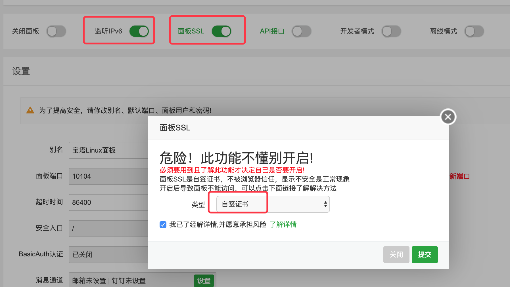

# 结合CloudFlare实现多端口IPv4+6访问

CloudFlare不仅支持常规的80和443端口，同时还支持了以下端口，因此也可以通过CloudFlare来转发这些端口实现IPv6-&gt;IPv4+v6的访问，让小鸡的玩法多样起来！

```text
HTTP ports supported by Cloudflare:
80
8080
8880
2052
2082
2086
2095
HTTPS ports supported by Cloudflare:
443
2053
2083
2087
2096
8443
```

这里以转发宝塔面板为例抛砖引玉，供大家参考。

首先参考 [https://doc.cloudraft.cn/products/ecs/kvmnat/baota](https://doc.cloudraft.cn/products/ecs/kvmnat/baota) 安装完宝塔并确定可以访问。

然后我们去CloudFlare控制面板中，添加AAAA解析，例如这里将cloudraft-nat-test.liujason.com解析到小鸡的IPv6上，记得开启加速功能（点亮橙色的云）：


然后在宝塔中开启【监听IPv6】功能的前提下，开启【面板SSL】，这里使用自签名证书。



提交后通过https重新访问面板，如果出现安全提示，请选择【继续访问】，如图：


然后还是在宝塔面板设置里面修改【面板端口】，改为8443（或者前面提到的任意一个支持https的端口）。


修改成功后，即可通过 https://域名:8443的方式在IPv4条件下访问宝塔面板了，例如这里可以通过https://cloudraft-nat-test.liujason.com:8443来访问。


